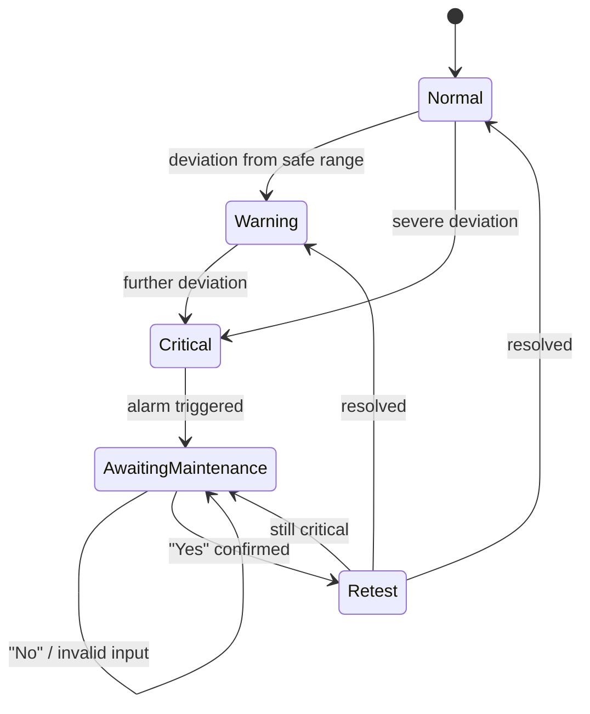

## alarmist-sim: Alarm & Safety Logic Simulator 🚨

[alarmist-sim](https://github.com/alissamaharaj/alarmist-sim/blob/main/alarmist-sim.py) is a temperature alarm and safety-response simulator, built to model the core decision logic behind industrial safety systems: continuous monitoring, threshold-based alerting, and mandatory operator response before a process can return to normal. Built as Python Project 1 of my self-study track in control systems and industrial data engineering (following Python for Everybody, Ch. 1–5).

Detailed process notes can be found in [notes.md](https://github.com/alissamaharaj/alarmist-sim/blob/main/notes.md).

---

### What it Does

The simulator generates random temperature readings for a 24-hour period and evaluates each one against defined safety thresholds. Depending on which threshold range the value falls in, it reports an alarm state: 'Normal', 'Warning', or 'Critical'. 

When a 'Critical' reading occurs, the simulator operation cycle is stopped and prompts the user to confirm whether necessary maintenance has been performed to ensure the temperature is back within range. It will be re-tested and reprompted as many times as required.

### Design Rationale

The idea behind this project design is standard procedure in industrial control systems and safety condition monitoring: faults always require dedicated attention and testing. I could have just created a value checker alarm that prints an alarm state for specific thresholds, but my technical background has ingrained proper safety and fault rectification protocols in me. It only felt right to me that the system would need retesting and verification before being allowed to continue following a fault. 

For this reason, I built in the following features: The 'CRITICAL' alarm state completely halts operation. It can only resume if it confirms that an operator has dedicated attention to the fault, and it must retest and confirm the fault was rectified. If not rectified, it remains halted until it can confirm rectification.

### State Diagram


### How it Works

- The 24-hour temperature values are randomly generated using the `random.uniform()` function.
- A `try/except` block is used for temperature parsing to block invalid inputs, implemented in single-value prototype, and retained in final version, though not exercised.
- The values are then assigned an alarm state using a `temp_alarm()` function created based on thresholds defined in `if/elif/else` logic.
- A definite iterating `for` loop runs each randomly generated temperature value through the `temp_alarm()`, printing the time, temperature, and alarm state for each.
- If a 'CRITICAL' temperature fault is detected, a `while` loop prompts for maintenance confirmation.
  - If the fault is not confirmed to be resolved or input is invalid, the loop will `continue` and reprompt the operator.
  - If maintenance is confirmed, a new temperature value is generated and evaluated as the post-maintenance temperature.
    - If this is still 'CRITICAL', the maintenance prompt loops again.
    - If resolved to a 'Normal' or 'Warning' temperature value, the loop can `break` successfully.

### Core Skills Demonstrated

- `if/elif/else` conditional logic.
- `try/except` invalid input handling.
- `for, while, break, continue` iterative control.
- State-based program design.

### Sample Output
```
STARTING TEMPERATURE ALARM
Time: 1 Temperature: 81.6
!!CRITICAL!!
Temperature Critical, attention required.
Was maintenance performed? (Yes/No):
Yes
Maintenance performed.
!!CRITICAL!!
79.47 Temperature after maintenance.
Temperature Critical, attention required.
Was maintenance performed? (Yes/No):
Yes
Maintenance performed.
-Normal-
15.84 Temperature after maintenance.
Temperature no longer critical.
Time: 2 Temperature: -9.48
~Warning~
...
ENDING TEMPERATURE ALARM
```

### Planned Extensions

- Running summary report (counts of Normal/Warning/Critical hours, number of maintenance events, worst reading of the day)

### Relevance to control systems

The basis of the project design is very relevant to industrial control systems and safety condition monitoring, as it is designed around the principle that faults always require dedicated attention and testing, and operating processes should not be allowed to continue without outside verification. The foundational logic of threshold detection, mandatory operator response, and reverification reflects the same principles using Python instead of PLCs or DCS.

### How to run

  `python alarmist-sim.py`
Requires Python 3 (standard library only — no external dependencies).
